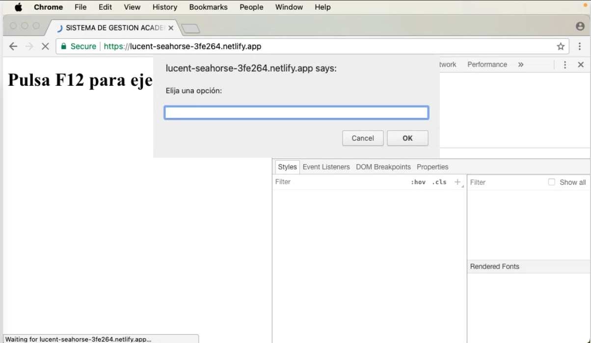

# PROYECTO SGAEA - MANEJO DE ESTUDIANTES Y ASIGNATURAS

Este proyecto tiene como objetivo gestionar el manejo de estudiantes y asignaturas utilizando herramientas modernas como **Node.js**, **Webpack** y **Babel** para crear una aplicación web eficiente. A continuación se detallan los pasos necesarios para configurar y ejecutar el proyecto.


### Realización de esta tarea
Para realizar esta tarea, lo primero que hice fue instalar en mi equipo:

- **Node.js**: Necesario para ejecutar el proyecto.
- **npm**: Para gestionar las dependencias y ejecutar comandos.

---

### Pasos a seguir:
1 - Inicializamos un nuevo proyecto de Node.js dentro de la carpeta de nuestro proyecto con el siguiente comando: 
```bash
npm init -y
```

2 - Instalamos las dependencias necesarias con el siguiente comando:
```bash
npm install
```
3 - Instalamos las dependencias específicas para Webpack y Babel: 
```bash
npm install --save-dev @babel/core @babel/polyfill @babel/preset-env babel-loader clean-webpack-plugin html-webpack-plugin webpack webpack-cli webpack-dev-server
```

4 - Creamos los archivos de configuración:

```markdown
**webpack.config.js**:
Este archivo configura Webpack para empaquetar el código JavaScript y los archivos de recursos. Además, se incluye la configuración de Babel para compilar el código y de plugins para limpiar la carpeta de salida y generar el archivo HTML.

**.babelrc**:
Este archivo contiene la configuración para Babel, que especifica el uso del preset `@babel/preset-env` para transpilar el código JavaScript a una versión compatible con los navegadores más comunes.
```


5 - El archivo webpack.config,js contendrá la siguiente información: 

```
const { CleanWebpackPlugin } = require('clean-webpack-plugin');
const path=require('path');
const { Template } = require('webpack');
const HtmlWebpackPlugin = require('html-webpack-plugin');


module.exports = {
    mode: 'production',
    entry: ['@babel/polyfill', './src/scripts/tarea4_5.js'],
    output: {
        filename: 'bundle.js',
        path: path.resolve(__dirname, 'dist')
    },
    module: {
        rules: [
            {
                test: /\.js$/,
                exclude: /node_modules/,
                use: {
                    loader: 'babel-loader'
                }
            },
            {
                test: /\.ttf$/,
                type: 'asset/resource'
            }
        ]
    },
    plugins: [
        new CleanWebpackPlugin(),
        new HtmlWebpackPlugin({
            template: './src/index.html'
        })
    ],
    
};
```
6 - El archivo babel contiene:
```
{
    "presets": ["@babel/preset-env"]
}
```

7 - Una vez todo configurado compilamos con el siguiente comando: 
```bash
npm run build
```

---

### Subir el código a Netlify

1. Regístrate en Netlify.com, usando tu cuenta de GitHub o mediante correo electrónico.
2. Si tienes tu código en un repositorio de GitHub, puedes conectar Netlify a tu cuenta de GitHub y desplegar el proyecto directamente. Si prefieres, también puedes subir los archivos compilados manualmente.
   - Los archivos que necesitas subir son `bundle.js` y `index.html`, que se encuentran en la carpeta `dist/` después de compilar el proyecto.
3. Netlify generará automáticamente tu página web a partir de esos archivos.

---
### Probar el código
Para probar que el código funciona usé Browserstack.com. 
- Chrome 61
  
  


